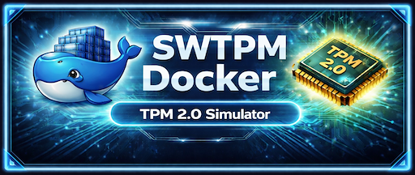

SWTPM Docker
============

This repository provides ready-to-use Docker images for [**SWTPM**](https://github.com/stefanberger/swtpm), a software-based TPM (Trusted Platform Module) emulator, enabling easy deployment and testing of TPM functionality in containerized environments.

**Docker Hub page:**  
<https://hub.docker.com/r/danieltrick/swtpm-docker>


Usage
-----

To start the SWTPM (Software TPM Emulator) via Docker, simply run:

```sh
$ docker run -p 127.0.0.1:2321-2322:2321-2322 danieltrick/swtpm-docker:r28
```

### TPM 2.0 Software Stack

The easiest way to work with the TPM simulator is via the **TPM 2.0 Software Stack (TSS2)**:
- <https://github.com/tpm2-software/tpm2-tss>
- <https://github.com/tpm2-software/rust-tss-fapi>

#### Configuration

You can set up TSS2 to use the TPM simulator with the following TCTI configuration:
```
swtpm:host=127.0.0.1,port=2321
```

For details, please refer to:  
<https://github.com/tpm2-software/tpm2-tss/blob/master/doc/tcti.md#tcti-swtpm>

### Example

Here is a simple example that uses [**`tpm2-tools`**](https://github.com/tpm2-software/tpm2-tools) to request random bytes from the TPM simulator:

1. Run the `TPM2_Startup` command, if not done already:
   ```sh
   $ tpm2_startup -T swtpm:host=127.0.0.1,port=2321 -c
   ```

2. Now run the `TPM2_GetRandom` command:
   ```sh
   $ tpm2_getrandom -T swtpm:host=127.0.0.1,port=2321 --hex 16
   ```


Version history
---------------

| **Release** | **Date**   | **Base system** | **SWTPM version**                                                                    | **libtpms version**                                                                    |
| ------------| ---------- | --------------- | ------------------------------------------------------------------------------------ | -------------------------------------------------------------------------------------- |
| r28         | 2026-06-11 | Alpine 3.24.0   | 0.11.0 / [`a1d85c9ee73a`](https://github.com/stefanberger/swtpm/commit/a1d85c9ee73a) | 0.11.0 / [`2d9b00c4e426`](https://github.com/stefanberger/libtpms/commit/2d9b00c4e426) |
| r27         | 2026-06-01 | Alpine 3.23.4   | 0.11.0 / [`4a748877d754`](https://github.com/stefanberger/swtpm/commit/4a748877d754) | 0.11.0 / [`06ec934c24ac`](https://github.com/stefanberger/libtpms/commit/06ec934c24ac) |
| r26         | 2026-04-17 | Alpine 3.23.4   | 0.11.0 / [`062307389032`](https://github.com/stefanberger/swtpm/commit/062307389032) | 0.11.0 / [`cea0585f5c5d`](https://github.com/stefanberger/libtpms/commit/cea0585f5c5d) |
| r25         | 2026-03-17 | Alpine 3.23.3   | 0.11.0 / [`407c2a57c168`](https://github.com/stefanberger/swtpm/commit/407c2a57c168) | 0.11.0 / [`77104fbfbdaf`](https://github.com/stefanberger/libtpms/commit/77104fbfbdaf) |
| r24         | 2026-03-06 | Alpine 3.23.3   | 0.11.0 / [`6bca01559021`](https://github.com/stefanberger/swtpm/commit/6bca01559021) | 0.11.0 / [`ec4b1a7d56f5`](https://github.com/stefanberger/libtpms/commit/ec4b1a7d56f5) |
| r23         | 2026-03-03 | Alpine 3.23.3   | 0.11.0 / [`f0606348e97a`](https://github.com/stefanberger/swtpm/commit/f0606348e97a) | 0.11.0 / [`9787502b169d`](https://github.com/stefanberger/libtpms/commit/9787502b169d) |
| r22         | 2026-02-24 | Alpine 3.23.3   | 0.11.0 / [`48358b244da8`](https://github.com/stefanberger/swtpm/commit/48358b244da8) | 0.11.0 / [`712ab4d53132`](https://github.com/stefanberger/libtpms/commit/712ab4d53132) |
| r21         | 2026-01-29 | Alpine 3.23.3   | 0.11.0 / [`d41849c30e78`](https://github.com/stefanberger/swtpm/commit/d41849c30e78) | 0.11.0 / [`c2a8109f8b44`](https://github.com/stefanberger/libtpms/commit/c2a8109f8b44) |
| r20         | 2026-01-23 | Alpine 3.23.2   | 0.11.0 / [`d41849c30e78`](https://github.com/stefanberger/swtpm/commit/d41849c30e78) | 0.11.0 / [`c2a8109f8b44`](https://github.com/stefanberger/libtpms/commit/c2a8109f8b44) |
| r19         | 2026-01-06 | Alpine 3.23.2   | 0.11.0 / [`d41849c30e78`](https://github.com/stefanberger/swtpm/commit/d41849c30e78) | 0.11.0 / [`fc8820cfaa8b`](https://github.com/stefanberger/libtpms/commit/fc8820cfaa8b) |
| r18         | 2025-12-11 | Alpine 3.23.0   | 0.11.0 / [`d41849c30e78`](https://github.com/stefanberger/swtpm/commit/d41849c30e78) | 0.11.0 / [`4f71e9b45db1`](https://github.com/stefanberger/libtpms/commit/4f71e9b45db1) |
| r17         | 2025-11-05 | Alpine 3.22.2   | 0.11.0 / [`8084873972b4`](https://github.com/stefanberger/swtpm/commit/8084873972b4) | 0.11.0 / [`7310725524c2`](https://github.com/stefanberger/libtpms/commit/7310725524c2) |
| r16         | 2025-08-12 | Alpine 3.22.1   | 0.11.0 / [`665486b8179f`](https://github.com/stefanberger/swtpm/commit/665486b8179f) | 0.11.0 / [`b4d81572c15b`](https://github.com/stefanberger/libtpms/commit/b4d81572c15b) |
| r15         | 2025-06-12 | Alpine 3.22.0   | 0.11.0 / [`4a0e632f3731`](https://github.com/stefanberger/swtpm/commit/4a0e632f3731) | 0.11.0 / [`04b2d8e9afc0`](https://github.com/stefanberger/libtpms/commit/04b2d8e9afc0) |
| r14         | 2025-02-20 | Alpine 3.21.3   | 0.11.0 / [`0528ac733b76`](https://github.com/stefanberger/swtpm/commit/0528ac733b76) | 0.11.0 / [`ecb769cdb8dd`](https://github.com/stefanberger/libtpms/commit/ecb769cdb8dd) |
| r13         | 2025-01-23 | Alpine 3.21.2   | 0.11.0 / [`0528ac733b76`](https://github.com/stefanberger/swtpm/commit/0528ac733b76) | 0.11.0 / [`ecb769cdb8dd`](https://github.com/stefanberger/libtpms/commit/ecb769cdb8dd) |
| r12         | 2025-01-15 | Alpine 3.21.2   | 0.11.0 / [`3d6a8b75b335`](https://github.com/stefanberger/swtpm/commit/3d6a8b75b335) | 0.11.0 / [`ecb769cdb8dd`](https://github.com/stefanberger/libtpms/commit/ecb769cdb8dd) |
| r11         | 2024-12-06 | Alpine 3.21.0   | 0.11.0 / [`314f5f411b32`](https://github.com/stefanberger/swtpm/commit/314f5f411b32) | 0.11.0 / [`f22745c72933`](https://github.com/stefanberger/libtpms/commit/f22745c72933) |
| r10         | 2024-09-28 | Alpine 3.20.3   | 0.10.0 / [`2e2124928f38`](https://github.com/stefanberger/swtpm/commit/2e2124928f38) | 0.10.0 / [`6adb99a42cf6`](https://github.com/stefanberger/libtpms/commit/6adb99a42cf6) |
| r9          | 2024-09-18 | Alpine 3.20.3   | 0.10.0 / [`017f99ceddb0`](https://github.com/stefanberger/swtpm/commit/017f99ceddb0) | 0.10.0 / [`e898872637b4`](https://github.com/stefanberger/libtpms/commit/e898872637b4) |
| r8          | 2024-09-13 | Alpine 3.20.3   | 0.10.0 / [`28292591cbef`](https://github.com/stefanberger/swtpm/commit/28292591cbef) | 0.10.0 / [`46548da8edbf`](https://github.com/stefanberger/libtpms/commit/46548da8edbf) |
| r7          | 2024-09-08 | Alpine 3.20.3   | 0.10.0 / [`607eb54b3e52`](https://github.com/stefanberger/swtpm/commit/607eb54b3e52) | 0.10.0 / [`e983cdf05c4e`](https://github.com/stefanberger/libtpms/commit/e983cdf05c4e) |
| r6          | 2024-09-05 | Alpine 3.20.2   | 0.10.0 / [`607eb54b3e52`](https://github.com/stefanberger/swtpm/commit/607eb54b3e52) | 0.10.0 / [`e983cdf05c4e`](https://github.com/stefanberger/libtpms/commit/e983cdf05c4e) |
| r5          | 2024-09-01 | Alpine 3.20.2   | 0.10.0 / [`0ddc7ed25491`](https://github.com/stefanberger/swtpm/commit/0ddc7ed25491) | 0.10.0 / [`f5518e596e65`](https://github.com/stefanberger/libtpms/commit/f5518e596e65) |
| r4          | 2024-08-29 | Alpine 3.20.2   | 0.10.0 / [`54583a87b536`](https://github.com/stefanberger/swtpm/commit/54583a87b536) | 0.10.0 / [`2dc1af12e5b0`](https://github.com/stefanberger/libtpms/commit/2dc1af12e5b0) |
| r2          | 2024-08-27 | Debian 12.6     | 0.10.0 / [`54583a87b536`](https://github.com/stefanberger/swtpm/commit/54583a87b536) | 0.10.0 / [`2dc1af12e5b0`](https://github.com/stefanberger/libtpms/commit/2dc1af12e5b0) |
| r1          | 2024-08-27 | Debian 12.6     | 0.10.0 / [`d6ca69ad4622`](https://github.com/stefanberger/swtpm/commit/d6ca69ad4622) | 0.10.0 / [`92ab42119406`](https://github.com/stefanberger/libtpms/commit/92ab42119406) |


Acknowledgement
---------------

The Docker images produced by this project incorporate the following third-party software components, each redistributed strictly in accordance with its respective license terms:

### SWTPM - Software TPM Emulator

The SWTPM package provides TPM emulators with different front-end interfaces to libtpms.

**Authors:**
* David Safford, safford@us.ibm.com
* Stefan Berger, stefanb@us.ibm.com

**Source:**  
<https://github.com/stefanberger/swtpm>

**License:**
```
(c) Copyright IBM Corporation 2006, 2010.

All rights reserved.

Redistribution and use in source and binary forms, with or without
modification, are permitted provided that the following conditions are
met:

Redistributions of source code must retain the above copyright notice,
this list of conditions and the following disclaimer.

Redistributions in binary form must reproduce the above copyright
notice, this list of conditions and the following disclaimer in the
documentation and/or other materials provided with the distribution.

Neither the names of the IBM Corporation nor the names of its
contributors may be used to endorse or promote products derived from
this software without specific prior written permission.

THIS SOFTWARE IS PROVIDED BY THE COPYRIGHT HOLDERS AND CONTRIBUTORS
"AS IS" AND ANY EXPRESS OR IMPLIED WARRANTIES, INCLUDING, BUT NOT
LIMITED TO, THE IMPLIED WARRANTIES OF MERCHANTABILITY AND FITNESS FOR
A PARTICULAR PURPOSE ARE DISCLAIMED. IN NO EVENT SHALL THE COPYRIGHT
HOLDER OR CONTRIBUTORS BE LIABLE FOR ANY DIRECT, INDIRECT, INCIDENTAL,
SPECIAL, EXEMPLARY, OR CONSEQUENTIAL DAMAGES (INCLUDING, BUT NOT
LIMITED TO, PROCUREMENT OF SUBSTITUTE GOODS OR SERVICES; LOSS OF USE,
DATA, OR PROFITS; OR BUSINESS INTERRUPTION) HOWEVER CAUSED AND ON ANY
THEORY OF LIABILITY, WHETHER IN CONTRACT, STRICT LIABILITY, OR TORT
(INCLUDING NEGLIGENCE OR OTHERWISE) ARISING IN ANY WAY OUT OF THE USE
OF THIS SOFTWARE, EVEN IF ADVISED OF THE POSSIBILITY OF SUCH DAMAGE.
```

### libtpms

Libtpms is a library that targets the integration of TPM functionality into hypervisors, primarily into Qemu.

**Authors:**
* Stefan Berger, stefanb@us.ibm.com
* William Roberts, william.c.roberts@intel.com

**Source:**  
<https://github.com/stefanberger/libtpms>

**License:**
```
For the TPM 1.2 code and the library code the following license applies:

(c) Copyright IBM Corporation 2006 - 2011

All rights reserved.

Redistribution and use in source and binary forms, with or without
modification, are permitted provided that the following conditions are
met:

Redistributions of source code must retain the above copyright notice,
this list of conditions and the following disclaimer.

Redistributions in binary form must reproduce the above copyright
notice, this list of conditions and the following disclaimer in the
documentation and/or other materials provided with the distribution.

Neither the names of the IBM Corporation nor the names of its
contributors may be used to endorse or promote products derived from
this software without specific prior written permission.

THIS SOFTWARE IS PROVIDED BY THE COPYRIGHT HOLDERS AND CONTRIBUTORS
"AS IS" AND ANY EXPRESS OR IMPLIED WARRANTIES, INCLUDING, BUT NOT
LIMITED TO, THE IMPLIED WARRANTIES OF MERCHANTABILITY AND FITNESS FOR
A PARTICULAR PURPOSE ARE DISCLAIMED. IN NO EVENT SHALL THE COPYRIGHT
HOLDER OR CONTRIBUTORS BE LIABLE FOR ANY DIRECT, INDIRECT, INCIDENTAL,
SPECIAL, EXEMPLARY, OR CONSEQUENTIAL DAMAGES (INCLUDING, BUT NOT
LIMITED TO, PROCUREMENT OF SUBSTITUTE GOODS OR SERVICES; LOSS OF USE,
DATA, OR PROFITS; OR BUSINESS INTERRUPTION) HOWEVER CAUSED AND ON ANY
THEORY OF LIABILITY, WHETHER IN CONTRACT, STRICT LIABILITY, OR TORT
(INCLUDING NEGLIGENCE OR OTHERWISE) ARISING IN ANY WAY OUT OF THE USE
OF THIS SOFTWARE, EVEN IF ADVISED OF THE POSSIBILITY OF SUCH DAMAGE.


For TPM 2 code that does not explicitly state a license, the following
license and notices apply:

TCG Reference Implementation for TPM 2.0
This code is informative.

The copyright in this software is being made available under the BSD License,
included below.

Copyright 2010-2022 Microsoft Corporation
Copyright 2022-2025 Trusted Computing Group and its contributors

All rights reserved.

BSD License

Redistribution and use in source and binary forms, with or without
modification, are permitted provided that the following conditions are met:

Redistributions of source code must retain the above copyright notice, this
list of conditions and the following disclaimer.

Redistributions in binary form must reproduce the above copyright notice, this
list of conditions and the following disclaimer in the documentation and/or
other materials provided with the distribution.

THIS SOFTWARE IS PROVIDED BY THE COPYRIGHT HOLDERS AND CONTRIBUTORS ""AS IS""
AND ANY EXPRESS OR IMPLIED WARRANTIES, INCLUDING, BUT NOT LIMITED TO, THE
IMPLIED WARRANTIES OF MERCHANTABILITY AND FITNESS FOR A PARTICULAR PURPOSE ARE
DISCLAIMED. IN NO EVENT SHALL THE COPYRIGHT HOLDER OR CONTRIBUTORS BE LIABLE
FOR ANY DIRECT, INDIRECT, INCIDENTAL, SPECIAL, EXEMPLARY, OR CONSEQUENTIAL
DAMAGES (INCLUDING, BUT NOT LIMITED TO, PROCUREMENT OF SUBSTITUTE GOODS OR
SERVICES; LOSS OF USE, DATA, OR PROFITS; OR BUSINESS INTERRUPTION) HOWEVER
CAUSED AND ON ANY THEORY OF LIABILITY, WHETHER IN CONTRACT, STRICT LIABILITY,
OR TORT (INCLUDING NEGLIGENCE OR OTHERWISE) ARISING IN ANY WAY OUT OF THE USE
OF THIS SOFTWARE, EVEN IF ADVISED OF THE POSSIBILITY OF SUCH DAMAGE.


For other TPM 2 code the following license and notices apply:

Licenses and Notices

  1. Copyright Licenses:

  - Trusted Computing Group (TCG) grants to the user of the source code in
    this specification (the "Source Code") a worldwide, irrevocable,
    nonexclusive, royalty free, copyright license to reproduce, create
    derivative works, distribute, display and perform the Source Code and
    derivative works thereof, and to grant others the rights granted herein.

  - The TCG grants to the user of the other parts of the specification
    (other than the Source Code) the rights to reproduce, distribute,
    display, and perform the specification solely for the purpose of
    developing products based on such documents.

  2. Source Code Distribution Conditions:

  - Redistributions of Source Code must retain the above copyright licenses,
    this list of conditions and the following disclaimers.

  - Redistributions in binary form must reproduce the above copyright
    licenses, this list of conditions	and the following disclaimers in the
    documentation and/or other materials provided with the distribution.

  3. Disclaimers:

  - THE COPYRIGHT LICENSES SET FORTH ABOVE DO NOT REPRESENT ANY FORM OF
  LICENSE OR WAIVER, EXPRESS OR IMPLIED, BY ESTOPPEL OR OTHERWISE, WITH
  RESPECT TO PATENT RIGHTS HELD BY TCG MEMBERS (OR OTHER THIRD PARTIES)
  THAT MAY BE NECESSARY TO IMPLEMENT THIS SPECIFICATION OR OTHERWISE.
  Contact TCG Administration (admin@trustedcomputinggroup.org) for
  information on specification licensing rights available through TCG
  membership agreements.

  - THIS SPECIFICATION IS PROVIDED "AS IS" WITH NO EXPRESS OR IMPLIED
    WARRANTIES WHATSOEVER, INCLUDING ANY WARRANTY OF MERCHANTABILITY OR
    FITNESS FOR A PARTICULAR PURPOSE, ACCURACY, COMPLETENESS, OR
    NONINFRINGEMENT OF INTELLECTUAL PROPERTY RIGHTS, OR ANY WARRANTY
    OTHERWISE ARISING OUT OF ANY PROPOSAL, SPECIFICATION OR SAMPLE.

  - Without limitation, TCG and its members and licensors disclaim all
    liability, including liability for infringement of any proprietary
    rights, relating to use of information in this specification and to the
    implementation of this specification, and TCG disclaims all liability for
    cost of procurement of substitute goods or services, lost profits, loss
    of use, loss of data or any incidental, consequential, direct, indirect,
    or special damages, whether under contract, tort, warranty or otherwise,
    arising in any way out of use or reliance upon this specification or any
    information herein.

  (c) Copyright IBM Corp. and others, 2012-2016
```

### Alpine Linux

Alpine Linux is an independent, non-commercial, general purpose Linux distribution.

**Authors:**  
The Alpine Linux Development Team

**Source:**  
<https://www.alpinelinux.org/>

**License:**  
Alpine Linux is a collection of open-source software components rather than a single licensed work, and therefore does not have a unified license. Its core components are distributed under a combination of widely used open-source licenses. The Linux kernel and core utilities such as BusyBox are licensed under the GNU General Public License v2 (GPLv2), while the musl standard C library is licensed under the MIT License. For more detailed information, please refer to the documentation of each package or the Alpine Linux package repository.


License
-------

The following license terms apply to all code in this repository, including the Dockerfile:

```
This is free and unencumbered software released into the public domain.

Anyone is free to copy, modify, publish, use, compile, sell, or
distribute this software, either in source code form or as a compiled
binary, for any purpose, commercial or non-commercial, and by any
means.

In jurisdictions that recognize copyright laws, the author or authors
of this software dedicate any and all copyright interest in the
software to the public domain. We make this dedication for the benefit
of the public at large and to the detriment of our heirs and
successors. We intend this dedication to be an overt act of
relinquishment in perpetuity of all present and future rights to this
software under copyright law.

THE SOFTWARE IS PROVIDED "AS IS", WITHOUT WARRANTY OF ANY KIND,
EXPRESS OR IMPLIED, INCLUDING BUT NOT LIMITED TO THE WARRANTIES OF
MERCHANTABILITY, FITNESS FOR A PARTICULAR PURPOSE AND NONINFRINGEMENT.
IN NO EVENT SHALL THE AUTHORS BE LIABLE FOR ANY CLAIM, DAMAGES OR
OTHER LIABILITY, WHETHER IN AN ACTION OF CONTRACT, TORT OR OTHERWISE,
ARISING FROM, OUT OF OR IN CONNECTION WITH THE SOFTWARE OR THE USE OR
OTHER DEALINGS IN THE SOFTWARE.

For more information, please refer to <https://unlicense.org>
```
